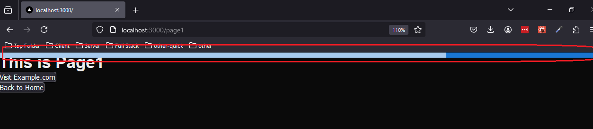

<h1>UX Indication for Navigation from Pages (Source) in Next.js App Router</h1>


<h2>Project Description</h2>
<p>
    This project demonstrates how to provide a UX indication (e.g., loading spinner) 
    when navigating between pages in a Next.js application using the App Router. 
    This includes both navigation within the app (e.g., internal page links) and to 
    external pages (e.g., OAuth2 login). The indication remains visible on the 
    source page until the target page is fully loaded or the user is redirected.
</p>


<h2>Motivation</h2>
<p>
    Navigation between pages, whether internal or external, often takes some time.
    Providing users with feedback during this waiting period significantly improves 
    the user experience.
</p>


<h2>Installation</h2>

install all packages using

```bash
pnpm i
```
Alternatively you can use npm

<h2>Usage</h2>

Invoke the server as follows 

```bash
npm run build
npm start
```

Navigate to internal and external page

```ts
const { navigateToInternalPage, navigateToExternalPage } = useNavigation();

  const navigateToInternal = () => {
    navigateToInternalPage("/");
  };

  const navigateToExternal = () => {
    navigateToExternalPage("https://www.example.com");
  };

  return (
    <>
      <h1>This is Page1</h1>
      <button onClick={navigateToExternal}>Visit Example.com</button>
      <br />
      <button onClick={navigateToInternal}>Back to Home</button>
    </>
  );
```


<h2>Design</h2>

<p>The design has three main parts</p>
    <p>The design consists of three main components:</p>
    <ul>
        <li>
          Implement a hidden loader in the app <code>layout.ts</code> (common to all pages), 
          and manage its visibility using Zustand for global state management.
        </li>
        <li>
          Trigger the loader before navigation begins, ensuring users see an indication on 
          the current page while navigating internally or externally.
        </li>
        <li>
          Use a custom hook for navigation to internal and external pages.
        </li>
    </ul>


<h2>Limitation</h2>

The build version is working correctly because RootLayout is called on 
every page navigation as follows


The development version is not working as expected and progress continue indefinetly. 
This is because RootLayout is called only once as follows , instead rebuilding is done
as follows


<h2>Demo</h2>
Navigate to a page show a progres on the page you navigate from



<h2>Points of Interest</h2>
  <ul>
      <li>
          Unlike the Page Router, the App Router does not provide easy-to-use events, 
          requiring custom logic for navigation progress. Note that Next.js router is 
          irrelevant for external navigation.
      </li>
      <li>
          Debugging <code>console.log</code> in <code>RootLayout</code> can be challenging, 
          as logs are cleared by the browser per page. To persist logs in Firefox, 
          go to DevTools → Console → Persist Logs.
      </li>
      <li>
          Add <code>children</code> to the dependency array in <code>RootLayout</code> 
          because re-renders depend on changes to <code>children</code>.
      </li>
  </ul>

